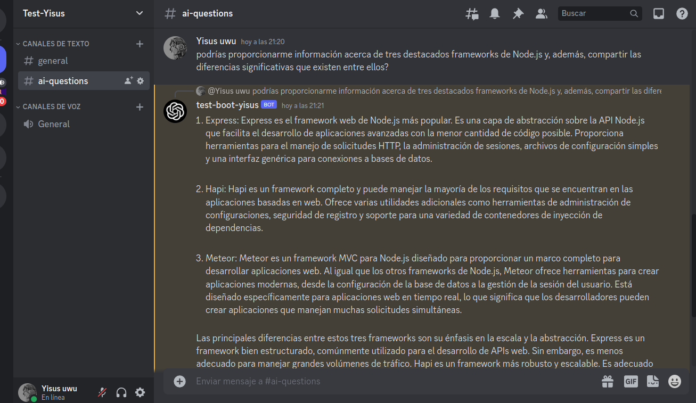
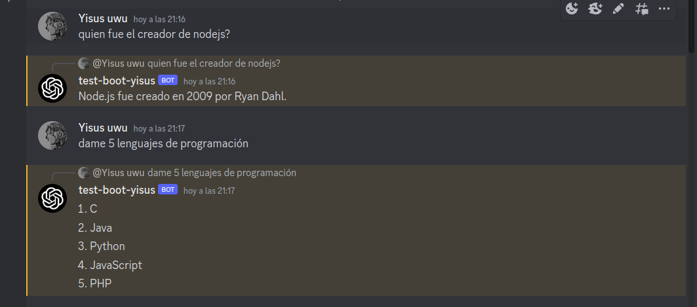

# Bot de Discord con ChatGPT

Este proyecto implementa un bot de Discord que utiliza la API de ChatGPT de OpenAI para brindar respuestas en tiempo real a preguntas en un canal específico de Discord. Este bot está desarrollado en Node.js y se sirve de la biblioteca discord.js.

## Instalación

Para ejecutar este proyecto en tu máquina local, sigue estos pasos:

1. Clona este repositorio en tu máquina local.
2. Ejecuta `npm install` para instalar las dependencias.
3. Renombra el `.env.example` a `.env`
4. Configura las variables de entorno necesarias:

   - `TOKEN`: El token de tu bot de Discord.
   - `API_KEY`: Tu API Key de OpenAI.
   
5. Inicia la aplicación con el comando `npm start`.

# Uso

Una vez que el bot esté en funcionamiento, se conectará a Discord y estará listo para responder en el canal "ai-questions". Si deseas cambiar el nombre del canal de escucha, puedes hacerlo modificando el código.

## Funcionamiento

El bot sigue un flujo de funcionamiento simple:

Escucha los mensajes en el canal "ai-questions" del servidor de Discord al que está conectado.

Cuando recibe un mensaje en ese canal, captura su contenido y lo envía a la API de OpenAI para obtener una respuesta utilizando el modelo "text-davinci-003".

La respuesta generada por ChatGPT se envía de vuelta al mismo canal de Discord para que los usuarios puedan verla.

Este bot puede servir como una herramienta de asistencia o una forma interactiva de obtener respuestas basadas en lenguaje natural en tu servidor de Discord.

## Ejemplos

A continuación, se presentan algunos ejemplos de cómo utilizar este bot en tu servidor de Discord:

### Ejemplo 1: Pregunta simple

### En este ejemplo, un usuario realiza una pregunta simple en el canal "ai-questions", y el bot responde con una respuesta generada por ChatGPT.

